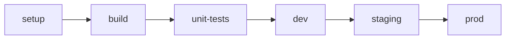

# NestJS Sample API Project for Etv

## API Specification

## Getting Started

### Cloning Repo

 
### Switch to Repo

### Installing Dependencies

## Project Structure

```
project
│   .gitlab-ci.yml
│
└───api
│
└───deploy
│
└───jobs

```

### Pipeline [.gitlab-ci.yml]
The project root contains the [Gitlab CI/CD](https://docs.gitlab.com/ee/ci/) pipeline definition `.gitlab-ci.yml`, but this is just a facade to a common set of build jobs defined in the template project. See [Gitlab CI/CD include examples.](https://docs.gitlab.com/ee/ci/yaml/includes.html)

#### Stages
The template pipeline sets up five stages for jobs to attach to.


Once your project has been setup you may remove the setup stage or remove the `check-preconditions.yml` include.
#### Pipeline Customization

If the need arises you can add your own jobs to the existing stages or customize the pipeline completely. This option should be carefully considered as you may lose the benefit of enhancements to the standard jobs over time.

It is preferable to use the provided pipeline steps but if your use case starts to out grow the starter setup you may replace the starter implementation.

> If you find there are additions or customizations that others may benefit from please consider contributing back to the project template.

### API Source Code [/api]

As per our [standards](https://dstvonline.atlassian.net/wiki/spaces/GD/pages/1681359158/Execution+Environment+AWS+Lambda) APIs that are customer facing `SHOULD` be NestJS APIs exposed via AWS Lambda. This starter project is a rather plain implementation and may require some additions based on your use-case.

For additional guidance on features that can be added to this project see [here](), [TODO create a confulence page to keep a list of NestJS guidance]

### Deployment Code [/deploy]
 
The deployment automation is contained in the `deploy` folder and is a AWS CDK project.

The basic code provided will deploy the lambda and create a rule on the default listener to route traffic for a `ping` function in the api
 
Additional rules may be added as needed in the file `deploy/lib/lambda-nest-api.ts`

 #### Team Infrastructure Project

If a team infrastructure project is referenced include the `INFRASTRUCTURE_CDK_PACKAGE` CI/CD variable to ensure that the latest version is used in the deployment.

## References

 * [Standard Service Domain Infrastructure](https://dstvonline.atlassian.net/wiki/spaces/GD/pages/2140045574/Standard+Service+Domain+Infrastructure)
 * [AWS Resource Tagging](https://dstvonline.atlassian.net/wiki/spaces/GD/pages/1634959474/AWS+Resource+Tagging)
